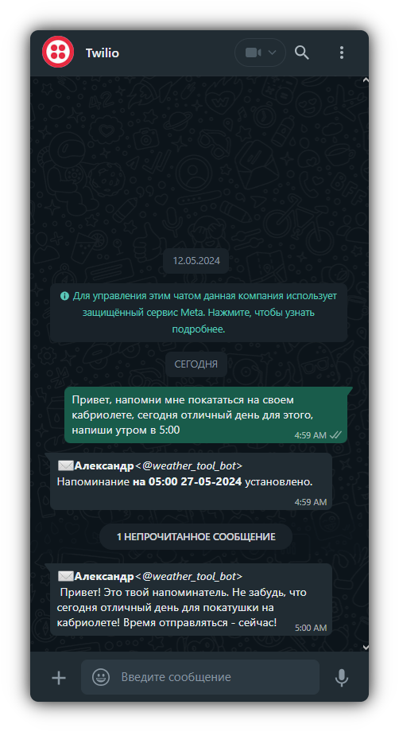
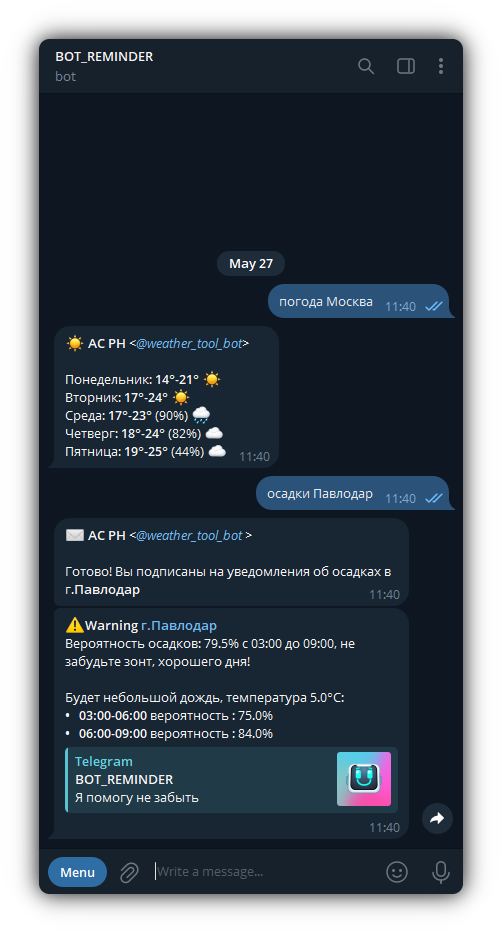
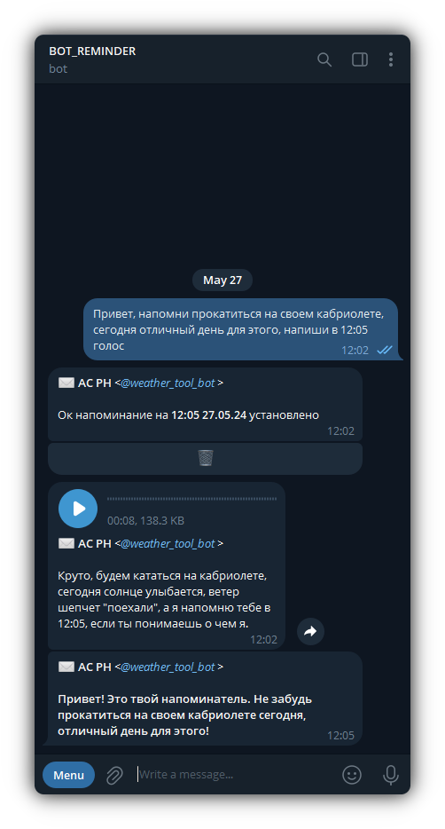
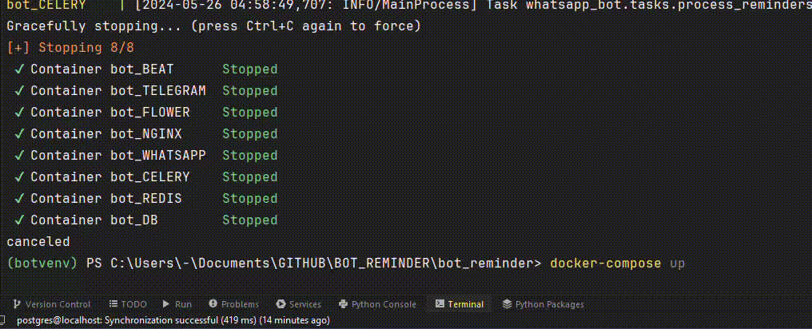

# ReminderBot: WhatsApp & Telegram AI Notes
-  Удобный чат-бот для организации вашего дня: напоминания, прогноз погоды на неделю и утренние предупреждения о возможных осадках
- Основные модули программы расположены в папке [**whatsapp_bot**](./bot_reminder/whatsapp_bot) и [**telegram_bot**](./telegram_bot)


[English](./README_en.md) | [Русский](./README.md)

<p align="left">
 
 
</p>

## Использование 
Умный бот с расширенными функциями голосового уведомления в напоминаниях, прогнозами и предупреждениями об осадках:
> - **функциями голосового уведомления** - добавьте слово "голос" в конце напоминания, реализция через ChatGPT и ElevenLabs, семпл ответа в корне каталога [**output.mp3**](./telegram_bot/output.mp3), см. скрин telegram  
> - **предупреждение об осадках** - активация по команде "осадки" и название города, бот пришлет уведомление в 6:00 если в этот день ожидаются осадки.  
> - **прогноз погоды** - команда "погода" и название города


## Применяемые технологии
WhatsApp секция выполнена на API Twilio, а Telegram с помощью Aiogram. Все модули запускаются из Docker-контейнеров, интерфейс отслеживания задач Flower, веб сервер выполнен на Nginx - Gunicorn 

> - **[django](https://www.djangoproject.com/)**:              веб-фреймворк Python.
> - **[postgreSQL](https://www.postgresql.org/)**:    объектно-реляционная СУБД.
> - **[celery](https://docs.celeryproject.org/)**:              система обработки задач.
> - **[redis](https://redis.io/)**:                                          система управления базами данных.
> - **[flower](https://flower.readthedocs.io/)**:           веб-интерфейс для мониторинга Celery задач.
> - **[twilio](https://www.twilio.com/)**:                            алтернативный API Whatsapp, облачная платформа коммуникаций.
> - **[ngrok](https://ngrok.com/)**:                                    инструмент для создания общедоступных точек доступа.
> - **[chatGPT (OpenAI)](https://openai.com/chatgpt)**: модель генерации текста.
> - **[nginx](https://nginx.org/)**:                                         веб-сервер.
> - **[gunicorn](https://gunicorn.org/)**:                               WSGI-сервер.
> - **[docker](https://www.docker.com/)**:                              платформа для разработки и доставки приложений в контейнерах.


<p align="left">
   
   
 
</p>

## Организация проекта

1. **bot_reminder**: основной каталог проекта и настройки приложения.

    - `celery_app.py`: настройки Celery для выполнения задач.
    - `manage.py`: основной исполняемый файл Django.

2. **whatsapp_bot**: приложение для работы с WhatsApp

    - `models.py`: модели данных для хранения информации
    - `utils.py`: функции извлечения инф. о напоминаниях, работы с датами
    - `tasks.py`: задачи Celery, обработка напоминаний
    - `views.py`: прием сообщений от API Twilio
    - `weather.py`: функции проверки прогноза погоды
    - `twilio.py`: функции отправки напоминаний через Twilio
    - `telegram.py`: функции отправки сообщений через Telegram
    - `tasks.py`: задачи Celery обработки напоминаний и проверки осадков
    - `services.py`: функции работы с базой данных
    - `gpt_responder.py`: функция преобразования текста запроса пользователя с использованием GPT

2. **telegram_bot**: приложение для работы с Telegram
    - `telegram_bot.py`: основной файл с обработчиками команд
    - `db_connect.py`: функции для работы с базой данных
    - `utils_base.py`: функции извлечения инф. и даты
    - `utils_demo.py`: функции для демонстрации работы с запросами
    - `utils_keyboard.py`: описание клавиатурных кнопок чата
    - `weather.py`: функции проверки осадков
      
3. **data** / **conf**: папки базы данных PostgreSQL/ конфигурации Nginx

## Начало работы
- **Вам потребуется настроенный аккаунт [Twilio](https://www.twilio.com/) и активированный webhook [Ngrok](https://ngrok.com/)**


```bash
# Клонирование репозитория
git clone https://github.com/AlexanderGithubProfile/WHATSAPP_BOT_REMINDER.git
```
- **Запустите приложение**
```bash
# Установка и запуск образов
docker-compose up
```

