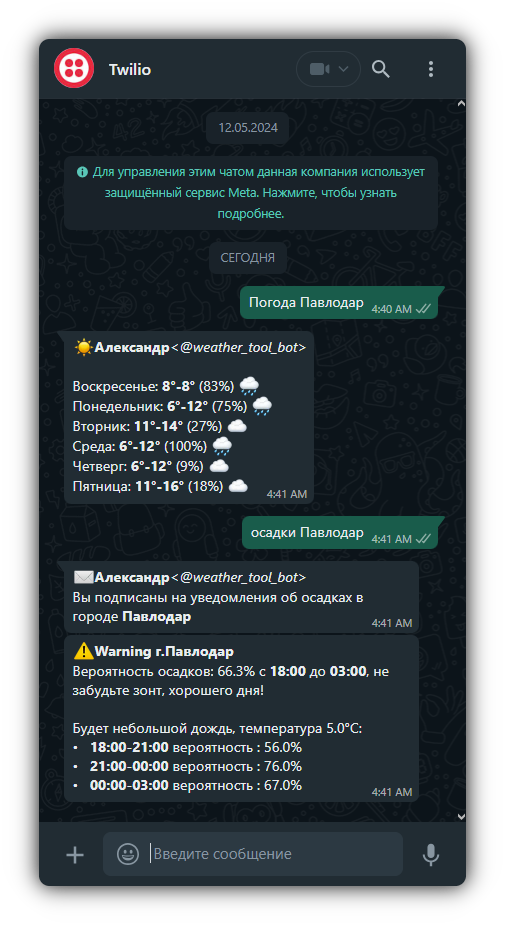
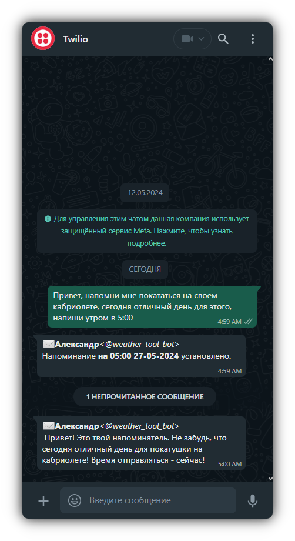
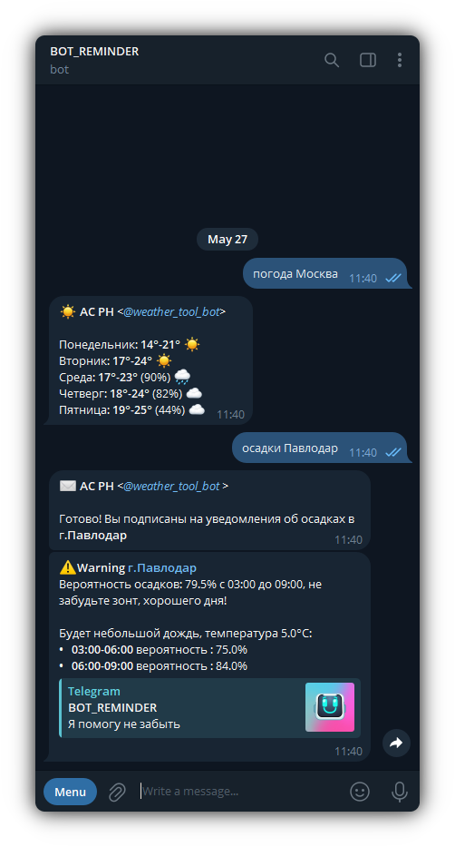
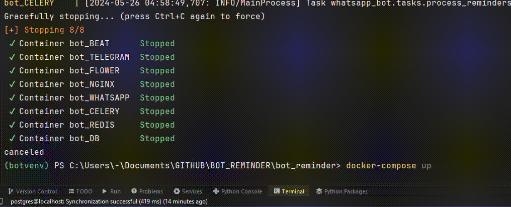

# ReminderBot: WhatsApp & Telegram AI Notes
-  A convenient chat bot for organizing your day: reminders, weekly weather forecasts, and morning precipitation alerts.
- The main program modules are located in the [**whatsapp_bot**](./whatsapp_bot) and [**telegram_bot**](./telegram_bot) folders.

[English](./README_en.md) | [Русский](./README.md)

<p align="left">
 
 
</p>

## Usage 
A smart bot with advanced voice notification features in reminders, forecasts, and precipitation alerts:
> - **voice notification features** - add the word "voice" at the end of the reminder, implemented through ChatGPT and ElevenLabs, sample response in the root directory [**output.mp3**](telegram_bot/assets/output.mp3), see Telegram screenshot  
> - **precipitation alerts** - activated by the command "precipitation" and the name of the city, the bot will send a notification at 6:00 AM if precipitation is expected that day.  
> - **weather forecast** - command "weather" and the name of the city

## Applied Technologies
The WhatsApp section is implemented using the Twilio API, and Telegram using Aiogram. All modules run from Docker containers, task tracking interface is Flower, and the web server is implemented on Nginx - Gunicorn 

> - **[django](https://www.djangoproject.com/)**:              Python web framework.
> - **[postgreSQL](https://www.postgresql.org/)**:    object-relational DBMS.
> - **[celery](https://docs.celeryproject.org/)**:              task processing system.
> - **[redis](https://redis.io/)**:                                          database management system.
> - **[flower](https://flower.readthedocs.io/)**:           web interface for monitoring Celery tasks.
> - **[twilio](https://www.twilio.com/)**:                            alternative WhatsApp API, cloud communications platform.
> - **[ngrok](https://ngrok.com/)**:                                    tool for creating public access points.
> - **[chatGPT (OpenAI)](https://openai.com/chatgpt)**: text generation model.
> - **[nginx](https://nginx.org/)**:                                         web server.
> - **[gunicorn](https://gunicorn.org/)**:                               WSGI server.
> - **[docker](https://www.docker.com/)**:                              platform for developing and delivering containerized applications.

<p align="left">
   
   
 
</p>

## Project Organization

1. **bot_reminder**: main project directory and application settings.

    - `celery_app.py`: Celery settings for task execution.
    - `manage.py`: main Django executable file.

2. **whatsapp_bot**: application for working with WhatsApp

    - `models.py`: data models for storing information
    - `utils.py`: functions for extracting info about reminders, working with dates
    - `tasks.py`: Celery tasks for processing reminders
    - `views.py`: receiving messages from the Twilio API
    - `weather.py`: functions for checking weather forecasts
    - `twilio.py`: functions for sending reminders via Twilio
    - `telegram.py`: functions for sending messages via Telegram
    - `tasks.py`: Celery tasks for processing reminders and checking precipitation
    - `services.py`: functions for working with the database
    - `gpt_responder.py`: function for transforming user request text using GPT

2. **telegram_bot**: application for working with Telegram
    - `telegram_bot.py`: main file with command handlers
    - `db_connect.py`: functions for working with the database
    - `utils_base.py`: functions for extracting info and dates
    - `utils_demo.py`: functions for demonstrating request handling
    - `utils_keyboard.py`: description of chat keyboard buttons
    - `weather.py`: functions for checking precipitation
      
3. **data** / **conf**: PostgreSQL database folders / Nginx configuration

## Getting Started
- **You will need a configured [Twilio](https://www.twilio.com/) account and an activated [Ngrok](https://ngrok.com/) webhook**

```bash
# Clone the repository
git clone https://github.com/AlexanderGithubProfile/WHATSAPP_BOT_REMINDER.git
```
- **Run the application**
```bash
# Install and run the images
docker-compose up
```
